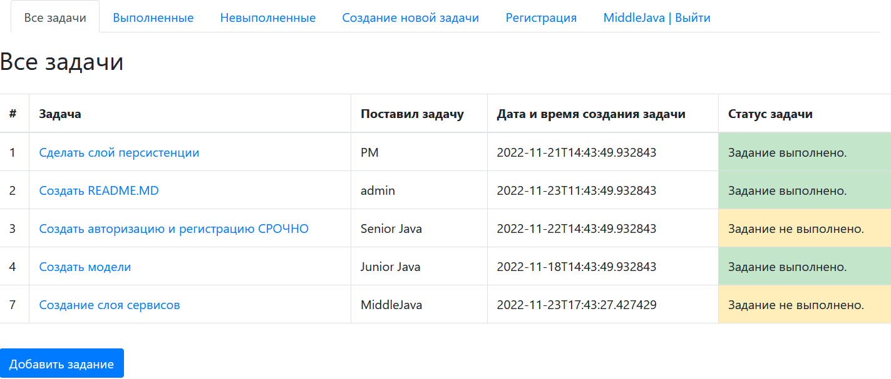
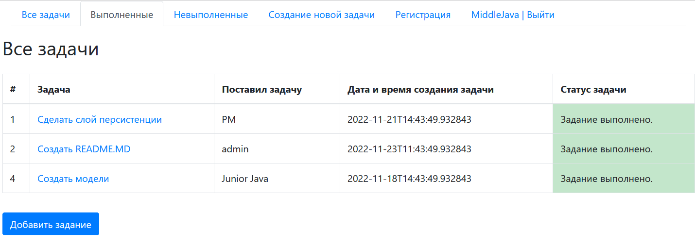
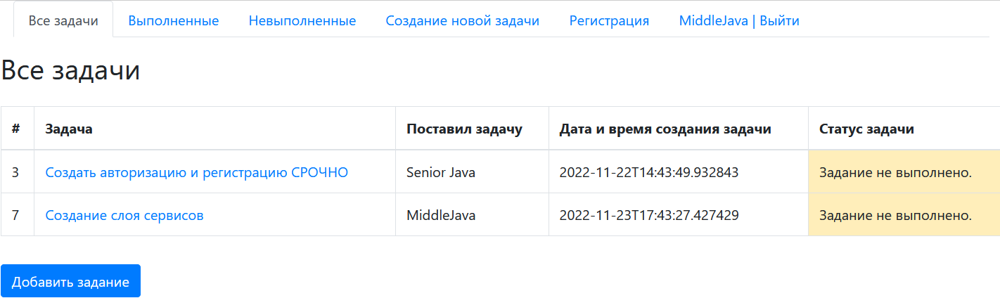
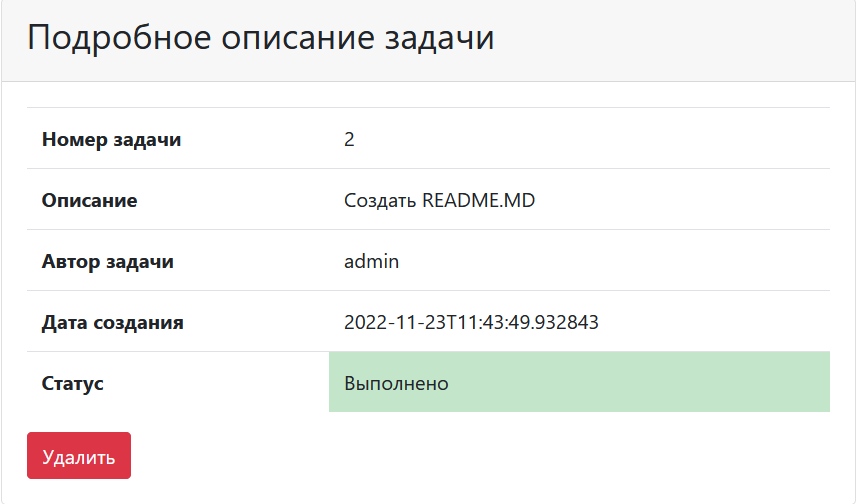
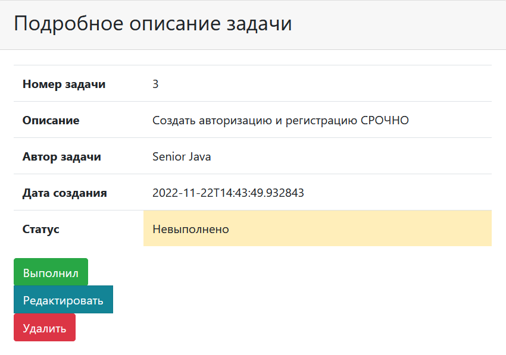
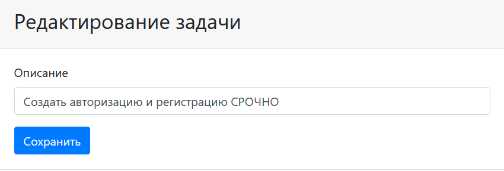
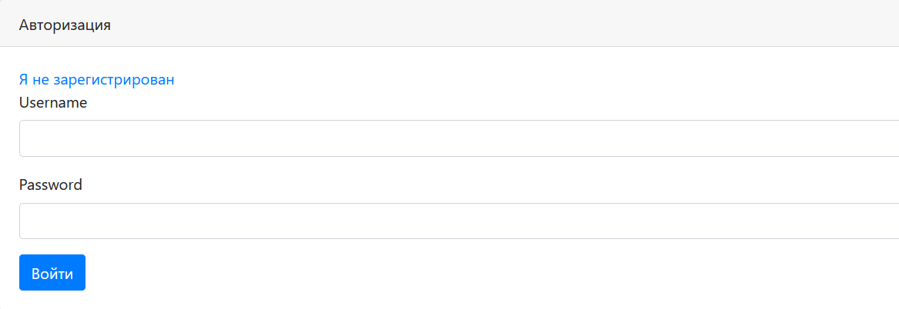
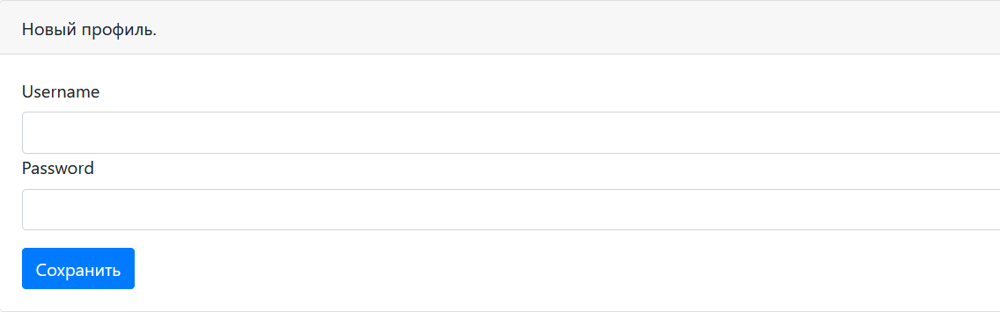

## Проект JOB4J_TODO
### Сервис для постановки и выполнения задач
### Стек технологий:
- Java
- Maven
- Spring boot 
- Thymeleaf
- Bootstrap
- Hibernate
- Liquibase

### Запуск приложения:

Создаем базу данных командой 
```shell
create database todo_db;
```

Создаем таблицы с помощью Liquibase, далее производим запуска самого приложения командой 
```shell
mvn spring-boot:run
```

### Как использовать:

Всего есть три вида с разными задачами

#### Вид со всеми задачами



### Вид с выполненными задачами



### Вид с невыполненными задачами



### Детализация выполненной задачи



### Детализация невыполненной задачи



Нажатие на кнопку "Выполнил" переведет статус на соответствующий.
На кнопку "Удалить" задача будет удалена.

### Обновление описания задачи



### Для работы с приложением необходимо авторизоваться



### Или зарегистрироваться



### Контакты: kshift84@gmail.com